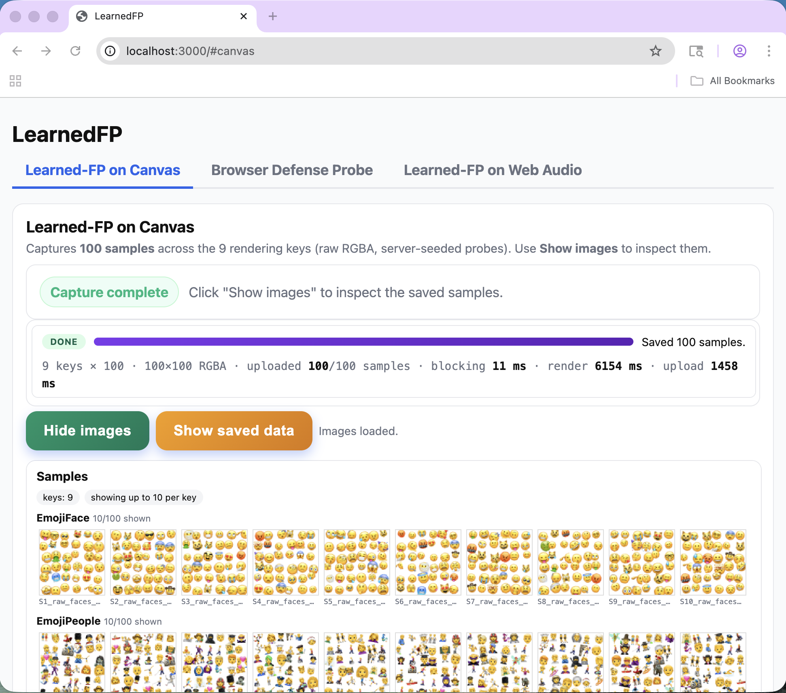
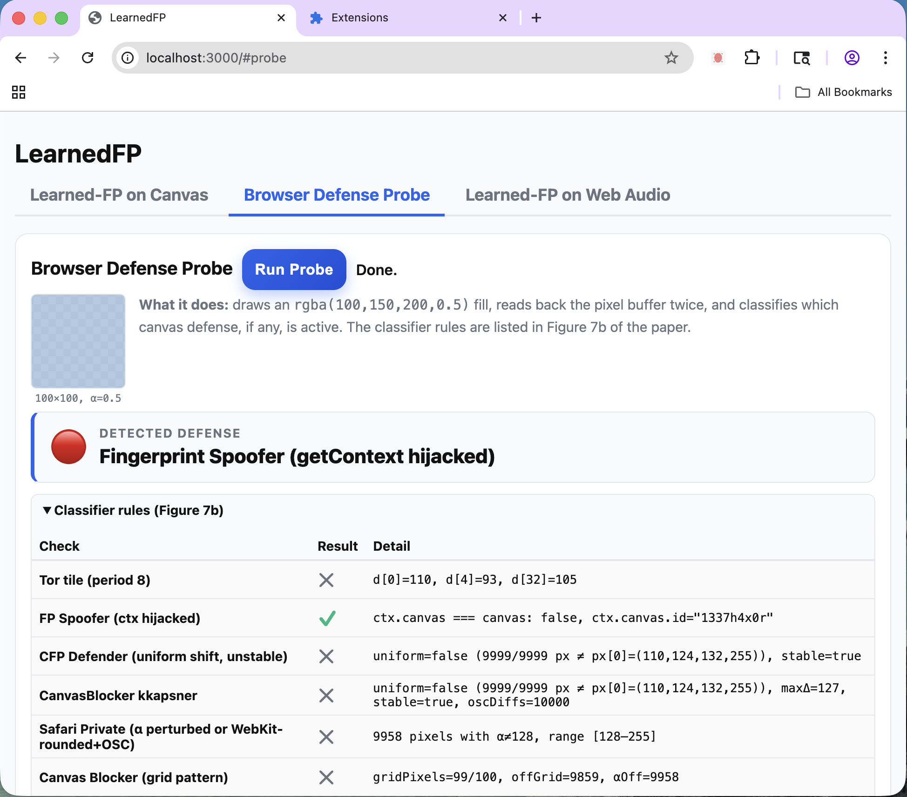
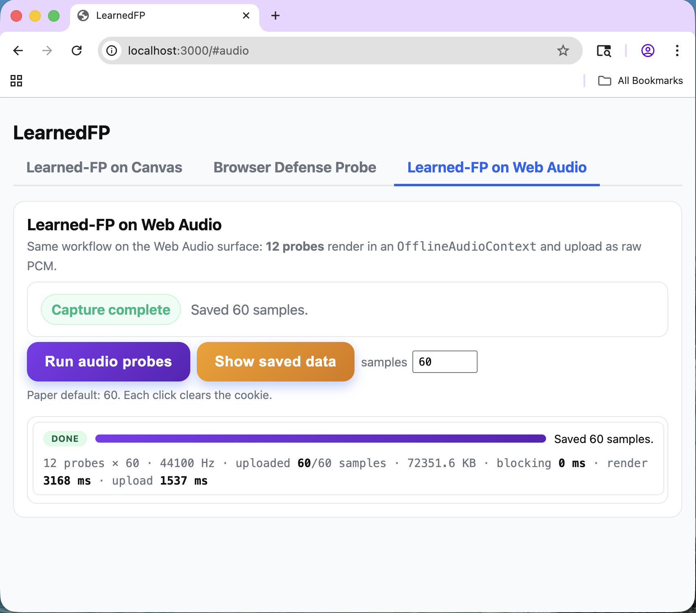

# LearnedFP — Artifact

Source code accompanying the paper

> **When Tracking Learns: Learning-Based Browser Fingerprinting Under
> Anti-Fingerprinting Defenses**

## Quick start

```bash
cd framework && docker compose up --build
```

Open <http://localhost:3000>. Three tabs, one click each:

1. **LearnedFP on Canvas** — captures 100 samples × 9 keys, stored as raw RGBA (paper §4 / Figure 2).
2. **Browser Defense Probe** — runs the half-alpha probe and reports the active defense (paper Figure 7 + Table 4).
3. **LearnedFP on Web Audio** — captures 60 Float32 samples × 12 probes (paper §7.1).

Uploads land under `local-data/` inside `framework/`. Bare-Node setup, env vars,
endpoint reference: [`framework/README.md`](framework/README.md).

<table cellspacing="14" cellpadding="6">
<tr>
<th align="center" width="33%">LearnedFP on Canvas</th>
<th align="center" width="33%">Browser Defense Probe</th>
<th align="center" width="33%">LearnedFP on Web Audio</th>
</tr>
<tr>
<td></td>
<td></td>
<td></td>
</tr>
</table>

## What's in this repo

The LearnedFP components below, plus two third-party baselines:
DRAWNAPART for the head-to-head ML comparison, FingerprintJS as the
industry-standard heuristic reference.

Released components (7):

- **LearnedFP framework** (probe gen / render / upload / ingestion / validation) → [framework/](framework/README.md)
- **LearnedFP on Web Audio** → [framework/](framework/README.md) (audio tab)
- **Defense-detection probe** → [framework/](framework/README.md) (probe tab)
- **Lab LearnedFP samples** (12 lab configurations × 5 instances; 5 archives bundled, the rest via `lab_data/fetch_devices.py`) → [lab_data/](lab_data/README.md)
- **Metadata-consistency check** (same-device labels, §5.1) → [consistency/](consistency/README.md)
- **Evaluation pipeline** (encoder training, profile construction, Top-k) → [pipeline/](pipeline/README.md)
- **Mitigation prototype** (browser extension) → [mitigation/](mitigation/README.md)

Third-party baselines (added for the head-to-head comparisons in §5):

- **DRAWNAPART** ([upstream](https://github.com/drawnapart/drawnapart); Laor et al., NDSS'22) → [baselines/drawnapart/](baselines/drawnapart/README.md)
- **FingerprintJS** ([upstream](https://github.com/fingerprintjs/fingerprintjs)) → [baselines/fpjs/](baselines/fpjs/README.md)

FingerprintJS is not redistributed here; it is an npm dependency (v4 line,
BUSL-1.1) fetched at install time. For DRAWNAPART, the encoder definition is
the authors' own, taken from their released notebook and redistributed with
their written permission (see `NOTICE`); their collector is referenced
upstream rather than copied.

## Reproducing the evaluation

The ML side (per-key training, profile construction, Top-k) lives in
[`pipeline/`](pipeline/README.md). A 2-3 minute CPU smoke test against the
bundled lab gallery:

```bash
pip install -r pipeline/requirements.txt
bash pipeline/demo.sh
```

The Docker equivalent, the command for each evaluation setting in the
paper (one per table row) and the config-to-section map are in
[`pipeline/README.md`](pipeline/README.md). The DRAWNAPART evaluation
adapter, its input contract and the pointer to the upstream code are in
[`baselines/drawnapart/README.md`](baselines/drawnapart/README.md). The
mitigation prototype loads as an unpacked Chromium extension, see
[`mitigation/README.md`](mitigation/README.md).

## What's NOT released (Open Science, Appendix A)

- **Crowdsourced corpus** — device-identifying.
- **Trained model weights** — would lower the bar to deploy a learning-based tracker.

**On exact-number reproduction.** Paper §5.2-§5.4 numbers are computed
on the withheld crowdsourced corpus. The bundled `lab_data/` gallery
verifies the full code path end-to-end; the absolute Top-1 / Top-5
will not match paper Tables 2-5. To obtain a comparable dataset, run
the matching collector on a fresh cohort.

## Citing

```bibtex
@inproceedings{lin2026tracking,
  title     = {When Tracking Learns: Learning-Based Browser Fingerprinting
               Under Anti-Fingerprinting Defenses},
  author    = {Lin, Xu},
  booktitle = {Proceedings of the 2026 ACM SIGSAC Conference on Computer and
               Communications Security (CCS)},
  year      = {2026},
  publisher = {ACM}
}
```

The artifact is archived at Zenodo under <https://doi.org/10.5281/zenodo.22698139>,
which resolves to the latest version. [`CITATION.cff`](CITATION.cff) carries
the same metadata in the form GitHub and Zenodo read.

## License

MIT, see [`LICENSE`](LICENSE). Third-party components used by the baselines
are subject to their own terms; see [`NOTICE`](NOTICE).

The author developed this artifact with coding and editorial assistance
from Claude (Anthropic).

## Demo videos

The second and third videos were recorded on the production deployment,
with the trained encoders and gallery that are not part of this release.

- [`videos/defense_detection.mp4`](videos/defense_detection.mp4) — Browser Defense Probe across browsers (paper §6, Figure 7).
- [`videos/device_identification.mp4`](videos/device_identification.mp4) — end-to-end identification (paper §5).
- [`videos/cross_session_cross_site.mp4`](videos/cross_session_cross_site.mp4) — one device enrolled on one site and re-identified from a private window and from a second site, under four browsers' defenses.
